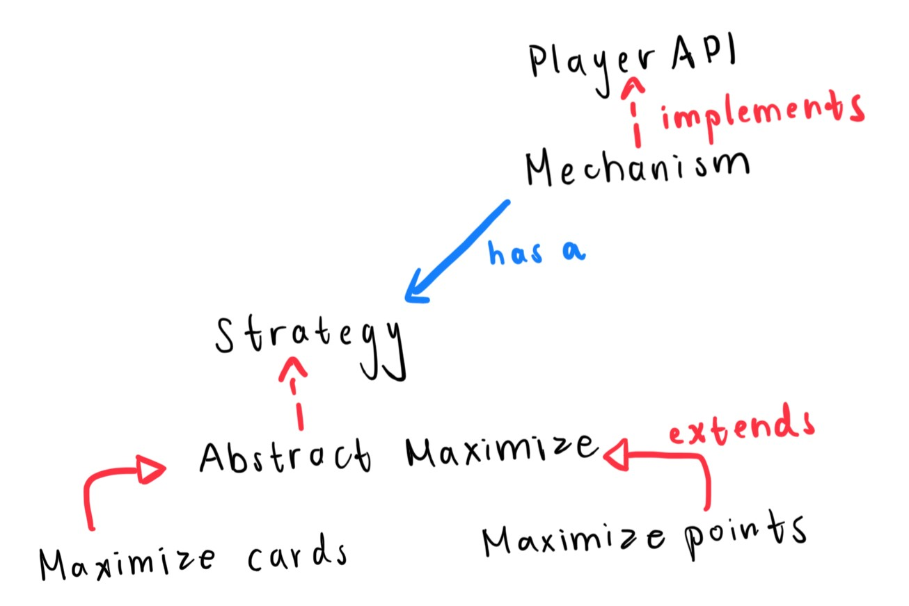

# Player
This folder contains all files related to a player. Currently, it supports two strategies 
in determining how to take a turn given a turn state.

## Overview
- Strategy: interface that all strategies must implement
- AbstractMaximize: a maximizing strategy
- MaximizeCards: a strategy that maximizes how many cards are bought in the turn
- MaximizePoints: a strategy that maximizes how many points are earned in the turn

- PlayerAPI: interface that all player mechanisms must implement
  - these are the methods that referee knows the player has
- Mechanism: the mechanism for the server's test players
  - Uses a strategy to decide moves

