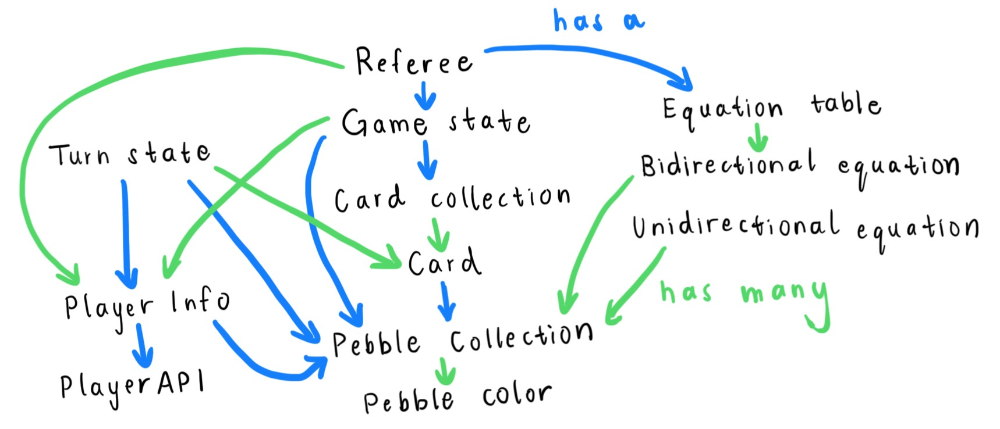

# Bazaar
## Purpose
This code base represents a game of Bazaar. The game is roughly as follows:
- The currency is represented as pebbles.
- Every player has a wallet, or collection, of pebbles.
- There is a bank of pebbles.
- There is a set of equations that describes the kind of pebble collection exchanges that can be made in the game.
- There is a deck of cards that players can buy with pebbles to earn points.

A player's turn consists of making pebble exchanges with the bank using the equations and buying
cards using their wallet. The goal is to win the game by having the most points when the game ends.

## Repository overview
- Common: Houses all common files shared between the referee (who enforces the rules) and the players (who play the game)
  - Includes the data representations of the different elements of the game
  - Includes the rules for the game, which handles legality checking, scoring, and game termination
- Planning: Houses files regarding how we plan to build out the structure of the game
- Player: Houses all files that relate to a player in the game
  - Currently contains strategies
- Referee: Houses all files that relate to the referee of the game
- Tests: Houses all the tests
  - Includes unit tests for all methods
  - Includes JSON parsing framework for integration testing
- Server: Houses all files that relate to the server side of the server-client components.
  - Includes xserver executable to start a server that is connecting to clients and runs a game
    from a given game state for a server-client integration test.
  - to run the test, run ./xserver and provide an open port to start the server at
    and a Json representation of a game-state. Optional: Add a bonus game-mode (USA / SEY).
- Client: Houses all files that relate to the client side of the server-client components.
  - Includes xclients executable to launch multiple clients and connect
    them to a running server for a server-client integration test.
  - to run the test, run ./xclients and provide a port to a running server and a list of actors
    in Json format.

## Testing
To run the unit tests:
- Create a test configuration that compiles all files and runs the corresponding tests
  - Ensure maven is installed (will download testing library JUnit)
      - Run xtest shell script (./xtest)

## Data representation relationships

