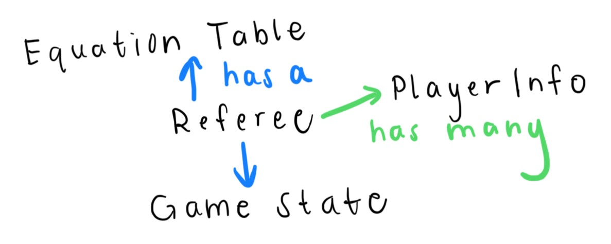
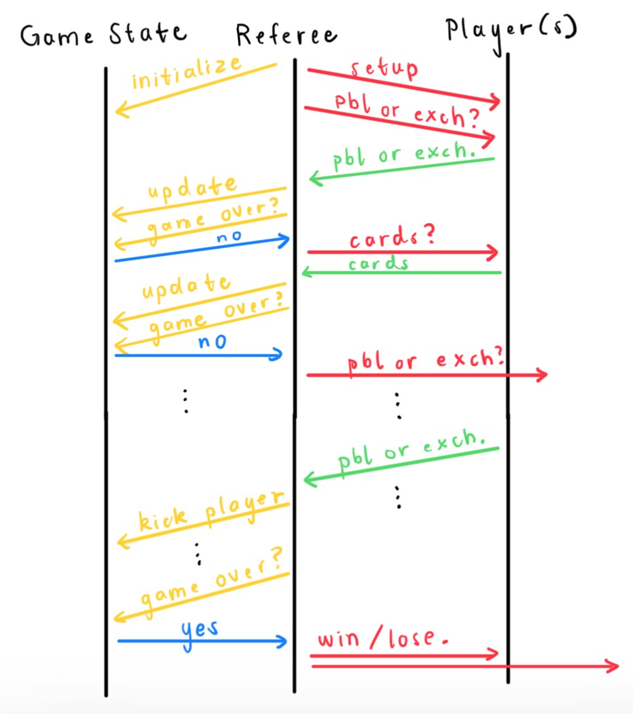

# Referee
This folder contains all files related to the referee. Currently, it contains the information 
regarding an entire game state. 

## Overview
- GameState: represents a single state of the game
- PlayerInfo: represents the information the referee has regarding a single player
- PlayerProxy: a proxy that handles exceptions thrown by the player 
- Referee: represents the Referee of the game, who runs the game from start to end and is in charge
of updating the state of the game, interacting with the players, and ensuring the game is legal
- Observer: represents an Observer of the game, who cannot interact with the game, but gets
every updated game state
- ObserverProxy: a proxy that handles exceptions thrown by the observer
- VisualObserver: an observer of the game that saves every game state as a png and also displays
every game state in a GUI
  - The referee interacts with this observer by sending the game state to it every time the state
    is updated. 

