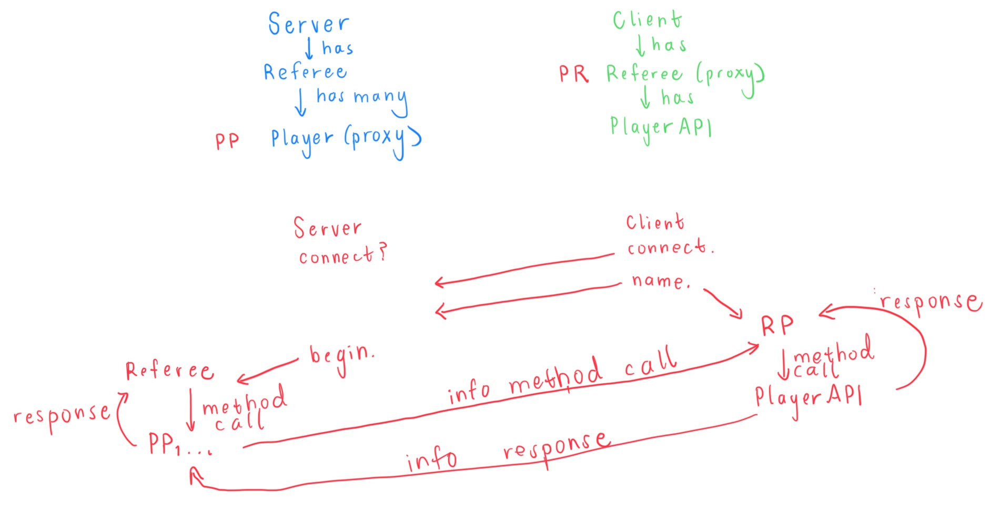

# Server
This folder contains all files corresponding to a server of the game. The server starts up to 
allow clients to connect, starts the game by initializing the Referee, and ends the game.

## Overview
**Server**: begins allowing clients to connect to the server, enforces client registration,
then begins the game and hands off the players to the Referee
**Player**: serves as a proxy player for every single player on a client, allowing the server's
Referee to communicate with the actual player on the client
**XServer**: serves as the server side for the integration test for the server client components.
the script starts a server at a given port, manages the client sign-up periods, and runs
a game from a given game state.
If given a Bonus specification, runs the game with a specified optional bonus game-mode.

How to run tests  
run ./xtest in Tests directory